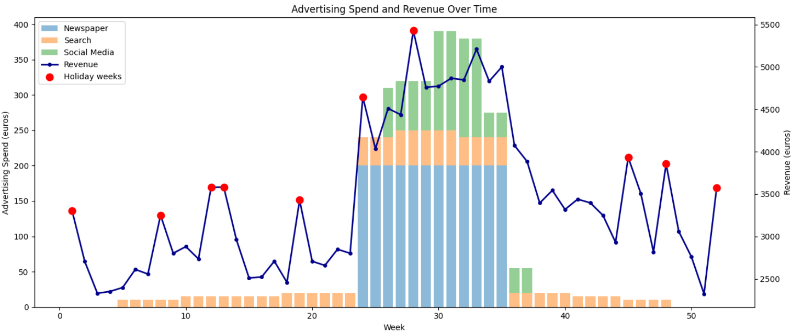
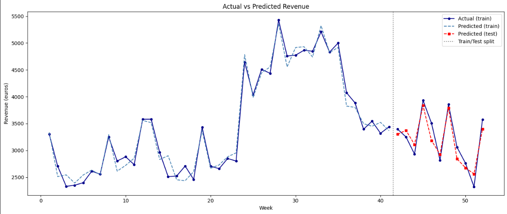
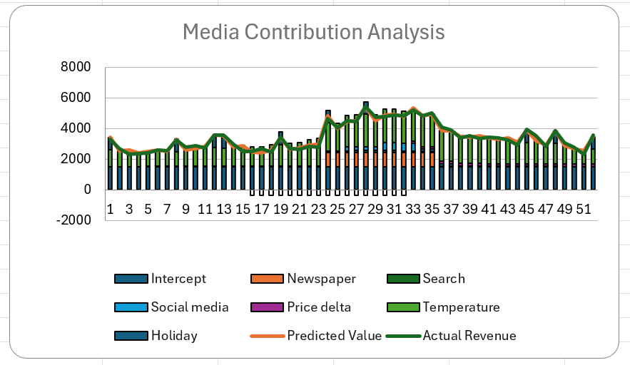

# Sales Forecasting with Multivariate OLS Regression
Ice tea sales data

## Overview

This project analyses 52 weeks of ice tea sales data to identify the key drivers of weekly revenue and build a forecasting model for marketing budget planning.

The central challenge was a structural one: all three advertising channels ran exclusively during the summer months, exactly when temperature was at its peak. This overlap made it difficult to isolate the advertising effect from seasonal demand.

## Libraries

Python: pandas, numpy, statsmodels, matplotlib, seaborn, scipy

## Methodology

I started with exploratory data analysis before building any model. Revenue followed a clear seasonal pattern, but holiday weeks showed consistently higher sales throughout the entire year and not just in summer. This indicated that the holiday effect was independent from the seasonal trend.

I recoded Price_delta as a categorical variable, because it takes only three fixed values (-10, 0, +10). Treating it as continuous would have imposed a linear relationship between price and revenue, which does not reflect the actual pricing structure.

Before running the regression, I checked for multicollinearity using VIF (Variance Inflation Factor). VIF measures how much each predictor overlaps with the others. A value of 1 means no overlap. Between 1 and 5 is acceptable. Between 5 and 10 is a moderate concern. Above 10 is severe, which means that the coefficient for that variable cannot be estimated reliably. Search scored 15.47, which is in the severe range. Newspaper and Temperature were both moderate. I kept Search in the model because removing it would have hidden a real limitation of the data and that is not useful for anyone who wants to use the model in practice.

I first ran a baseline model using only Newspaper (R^2 = 0.72) as a reference point, then the full model with all six predictors (R^2 = 0.97). The Newspaper coefficient dropped from 8.67 to 4.50 once Temperature was included. The baseline was absorbing part of the seasonal demand and attributing it to advertising. This is a textbook case of omitted variable bias. [^1] 
 
For validation, I split the data in order of time: weeks 1 to 41 for training and weeks 42 to 52 for testing. With a random split, the model could have been trained on week 50 and tested on week 10, which means it would have learned from data that comes after the weeks it is trying to predict. A time-based split avoids this problem. The test period covers mid-autumn to year-end, with no active advertising and temperatures dropping to 33 F: conditions that never appeared in the training data. A 5% MAPE on a test set this different from the training data shows that the model generalises well beyond the summer peak.

Residual analysis confirmed that both linearity and normality hold, so the model coefficients are reliable.

## Results

Five out of six predictors were statistically significant. Holiday weeks had the largest impact at +804 euro per week, followed by Temperature (+27.61 euro per F), Newspaper (+4.50 euro per euro spent), and Social Media (+3.71 euro per euro spent). Price discount had a negative effect of -752 euro per tier. Search was not significant (p = 0.62).

Search was not significant due to severe multicollinearity with Temperature. This does not mean that Search advertising does not work, it means that the data cannot tell us, because Search and Temperature moved together the entire year.

Full-model R²: 0.97, Test MAPE: 5%

MAPE (Mean Absolute Percentage Error) measures the average percentage difference between the predicted and the actual values. A 5% MAPE means that on average the model prediction is off by 5% compared to the real revenue. In sales forecasting, anything below 10% is generally considered a good result. In this case the result is particularly meaningful because the test set is structurally different from the training data, with no active advertising and much lower temperatures. Many models degrade significantly under these conditions.

## Media Contribution Analysis

The chart below breaks down the predicted revenue for each week into the contribution of each variable. It shows that during weeks 24 to 35, Newspaper and Social Media add a visible layer on top of the baseline driven by Temperature and Holiday. Outside of this window, when advertising spend drops to zero, revenue is explained almost entirely by Temperature and Holiday. This confirms that advertising has a real effect, but it operates on top of a strong seasonal baseline that no campaign can replicate in winter. The full Excel validation file including the decomposition chart is available in the excel_validation folder.

## Recommendations for the Marketing Team

- **Activate campaigns on every public holiday and not just in summer.** The model shows that holiday weeks generate 804 euro more in revenue compared to a regular week and this holds true in every season. This means that a holiday week in January performs significantly better than a regular summer week. Holiday weeks should have their own dedicated budget rather than being absorbed into the general seasonal plan.

- **Concentrate the advertising budget during peak season, not evenly across the year.** Sales are strongly driven by temperature and the data shows that revenue can vary by up to 1,220 euro between the coldest and warmest week of the year. Spending the same budget evenly across 52 weeks means investing in winter weeks where demand is naturally low and no amount of advertising can change that. The most efficient window is weeks 20 to 36, where high temperature and holiday weeks often overlap.
  
- **Invest in Newspaper and Social Media, but keep in mind that their ROI estimates may be higher than the real value.** Newspaper returns an estimated 4.50 euro per euro spent and Social Media 3.71 euro. However, because both channels only ran in summer, part of what looks like an advertising effect could still be seasonal demand. The real return is likely a bit lower, but both channels remain the most efficient ones available in this dataset.
  
- **Do not cut Search without testing it first in a low-season week.** Search appeared statistically irrelevant in this analysis, but that is a data problem, not a channel problem. Search only ran in summer, at the same time as temperature peaked and the other two channels were also active. It was impossible to separate its effect from everything else happening at the same time. Before making any budget decision on Search, it should be tested in a quiet period like a non-holiday week in autumn or winter where its impact can actually be measured on its own.

- **Use discounts only when the increase in sales volume justifies the cost.** Each discount tier costs 752 euro in lost revenue on average. Given that the average weekly revenue in this dataset is around 3,500 euro, that is a significant drop. A discount only makes sense if the increase in sales volume is large enough to cover that loss.

  [^1]: James, G., Witten, D., Hastie, T., Hastie, T., & Tibshirani, R. (2013). An Introduction to Statistical Learning. Springer.
